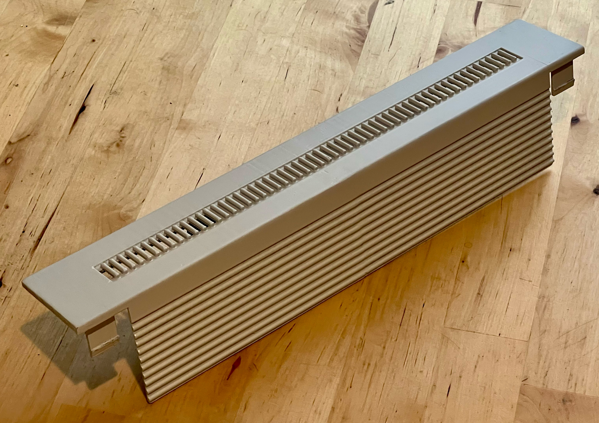
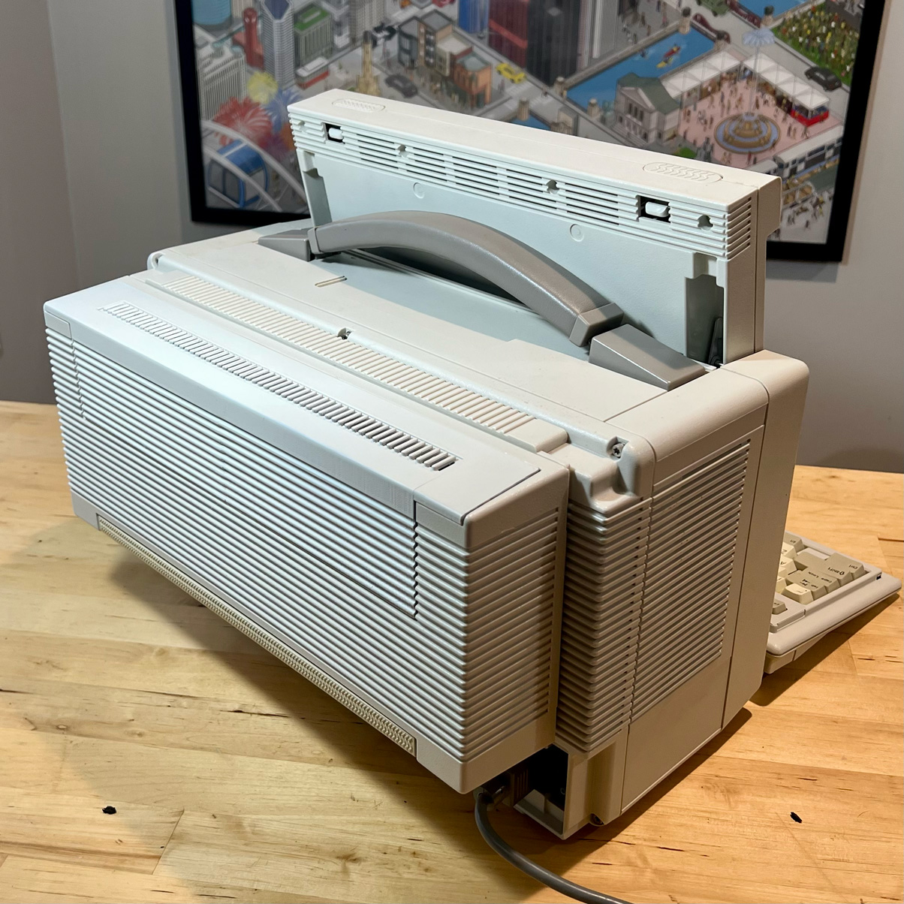

# Compaq

## Compaq Portable III / 386 Expansion Box Top Cover
The expansion box for the Compaq Portable III and 386 has a removable cover. Mine was missing, so I've attempted to recreate one from photo reference and measurements on the box itself.

[Download .STL from Releases page](https://github.com/nwah/computer-restoration/releases/tag/compaq-portable-386-cover-v1)

