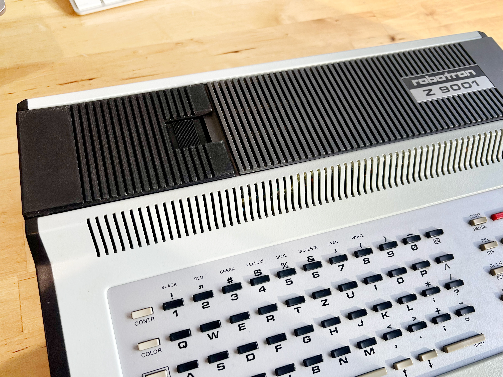
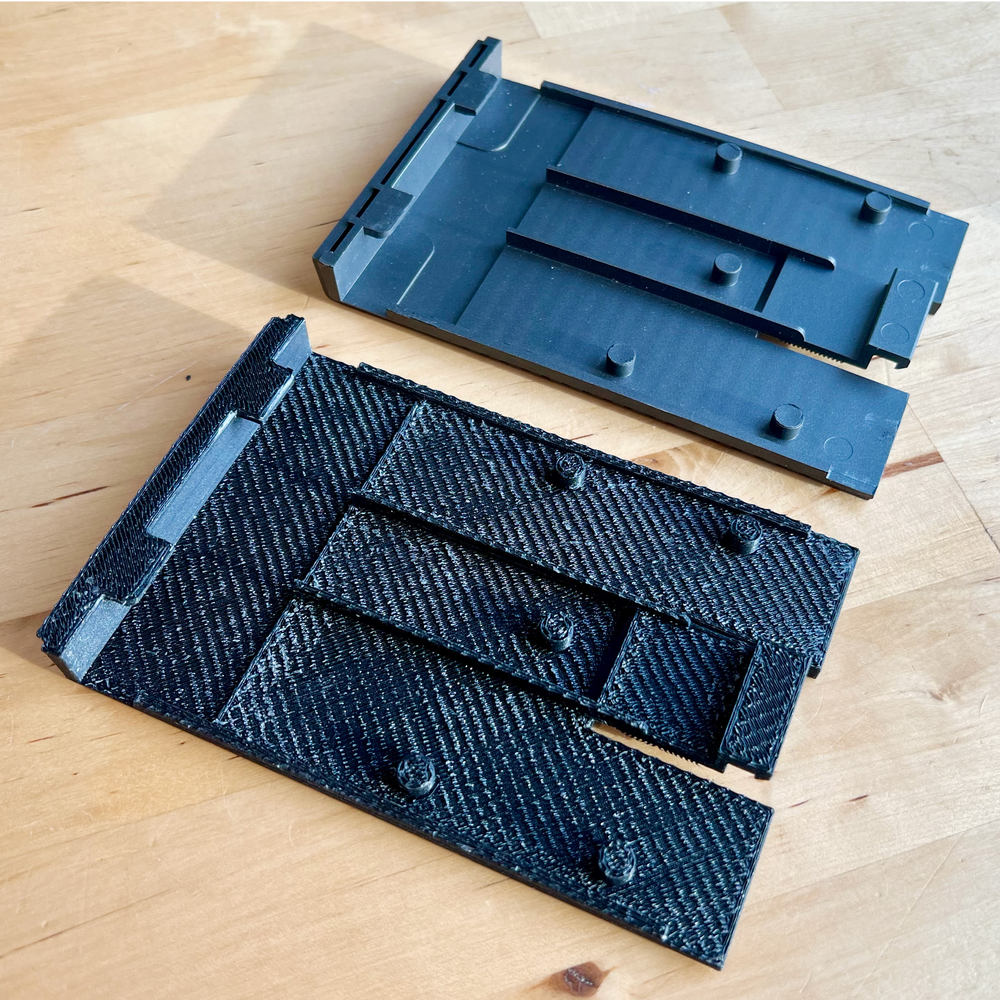
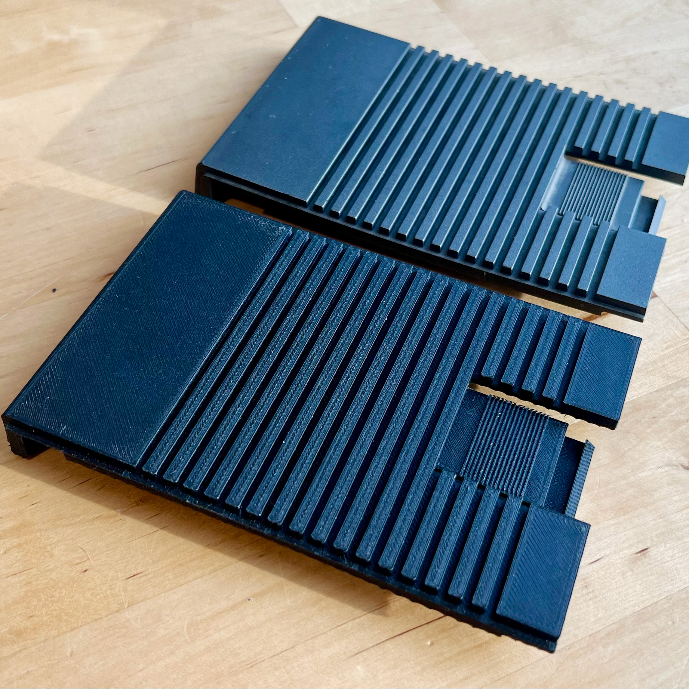

# Robotron Z 9001 Module Compartment Cover (Modulfachabdeckung)
The Robotron Z 9001, KC 85/1, KC 87 have a removable cover for the module compartment.
It is very common to have RAM, BASIC, or other modules installed, so the cover was often
removed, and in many cases lost.

[Download .STL file](https://github.com/nwah/3d-models/releases/latest)

